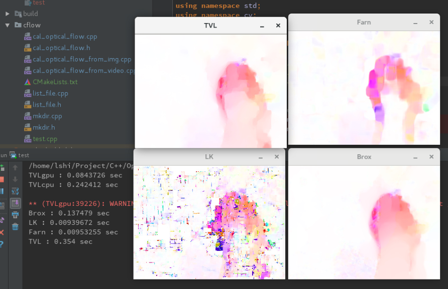

# Calculate OpticalFlow with (multi)CPU/GPU based on image/video
/cflow is the C++ realization of the algorithm. \
/pyflow is a python warper\
Directly decoding from video can save much IO time. 

## Requirement
Opencv >= 3.0 with GPU Support and Contrib installed

## Usage
mkdir build\
cd build\
cmake ..\
make

Their will be three executable files in bin/ \
./calOpticalFlowFromVideo -i=../data/v_ApplyEyeMakeup_g01_c01.avi
 -f=../out/ -s=1 -d=0 -t=1

Or use python warper showed in pyflow/

## Comparison
Original images: \

Results of different methods: \

Results using gpu/cpu mehtods: \
