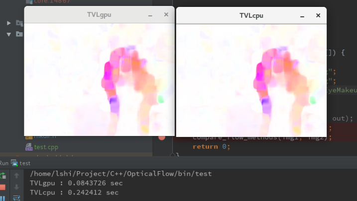

# Calculate OpticalFlow with (multi)CPU/GPU
/cflow is the C++ realization of the algorithm. \
/pyflow is a python warper\
Directly decoding from video can save much IO time. 

## Requirement
Opencv >= 3.0 with GPU Support and Contrib installed

## Usage
mkdir build\
cd build\
cmake ..\
make\

Their will be three executable files in bin/

## Comparison
Original images: \

Results of different methods: \

Results using gpu/cpu mehtods: \
